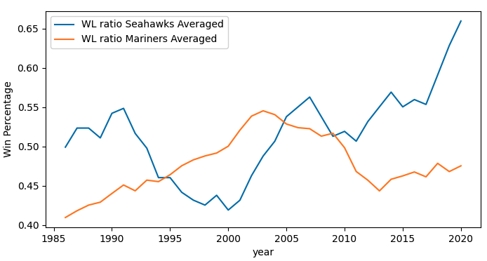

# Seattle Sports
## Datasets

Seattle, Washington sport data scraped from Wikipedia

## Github repo

https://github.com/DanWang1230/Seattle_sports

## Research questions

* How have the win percentages for Seahawks changed over the last forty years?
* How have the win percentages for Mariners changed over the last forty years?
* Compare the win percentages of the two sport teams at Seattle

## Methods

* This project was concerned with answering the question of how the win percentages of the two major Seattle sports teams (Seahawks and Mariners) have changed over the last 40 years.

* Wikipedia was scraped for data concerning wins and losses by season for each team. 

* Data cleaning has been conducted.

* A 10-year moving average was plotted to help the reader identify any major trends in the team’s win percentages.

## Results and Conclusions

* The plot indicates the years of high win percentage for Seahawks are around 1990 and 2007, with periods of decline following both high points.

* The Mariner’s win percentage shows a continuing increase up to 2003 and stays high from 2003 to 2010.

